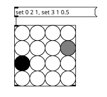
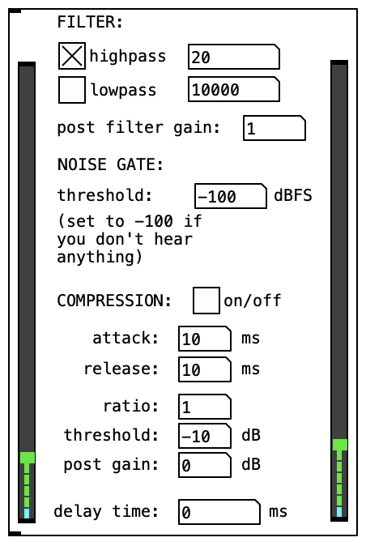
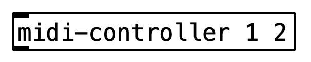
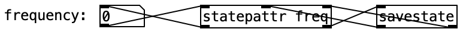
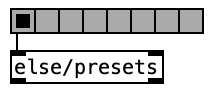
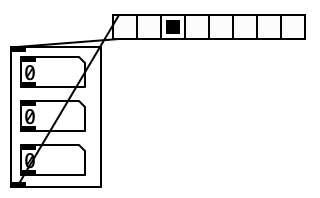

# -*- eval: (flyspell-mode); eval: (ispell-change-dictionary "en") -*-
#+CATEGORY: pd
#+title: rp_pd
#+author: Ruben Philipp
#+date: 2025-04-01
#+LANGUAGE: en
#+startup: overview

#+begin_comment
$$ Last modified:  00:40:21 Sun Jun 22 2025 CEST
#+end_comment

This is a collection of some [[https://github.com/pure-data/pure-data][Pure Data]] externals written by Ruben Philipp.

** Usage

It is necessary to include the externals and pdlua in the following order:

#+begin_src pd
[declare -lib pdlua -path rp_pd]
#+end_src

*** Faust

Some objects are written in [[https://faust.grame.fr][Faust]] and meant to be compiled via ~faust2puredata~.
See [[file:./faust/readme.org]] for more information.

Generally, you can run the following commands to compile the externals:

#+begin_src shell
# starting in this directory
cd faust
./compile.sh
#+end_src

** Requirements

- [[https://github.com/pure-data/pure-data][Pure Data]]
- [[https://github.com/agraef/pd-lua][pd-lua]]
- [[https://github.com/porres/pd-else][pd-else]]
- [[https://leomccormack.github.io/sparta-site/][SPARTA VST]] plugins
  - for =ambiencode~=

* Objects

** [matrixctrl]

#+ATTR_HTML: :width 300px

This is a Pd version of MaxMSP's ~[matrixctrl]~ object written in [[https://github.com/agraef/pd-lua][pd-lua]].

** [input-strip]

A channel strip for mono audio-input. 

** [midi-controller]

An abstraction for midi controller devices. 

** [midi-keyboard]

An abstraction for midi keyboard devices. 

** [statepattr]

This is a helper to store the data of an object with a ~[savestate]~ object.

** [presetsctrl]

This is a GUI for the ~[else/presets]~ object similar to MaxMSP's preset object
but without actual storing facilities. It works similar to the ~[preset]~ object
in this library but is meant to control an ~[else/presets]~ object.

** [preset]

This object stores the data of a connected object in various slots. The data
must be communicated in the form of lists of the form:

~[value-name value-1 .. value-n]~.

*NB:* It is recommended to use the ~[else/presets]~ object in conjunction with
the ~[presetsctrl]~ object in this library instead of ~[preset]~ for greater
flexibility.  For simpler projects though this object might still be of
interest.

** [ambienc~ ...]

A higher order ambisonics encoder based on SPARTA VST.

This object is based on the sparta_ambiENC VST plugin from the SPARTA plugin
suite. Thus it requires both the \[vstplugin~\] external as well as the SPARTA
VSTs installed on this system.

NB: This plugin only accepts and returns multi-channel signals. 

** [faust/limiter~]

This is a Pd version of the Faust (co.)limiter_lad_mono lookahead limiter.
